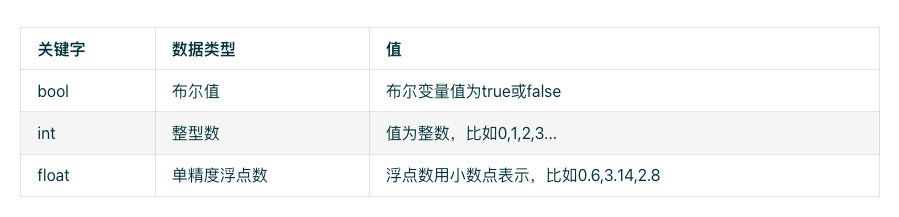
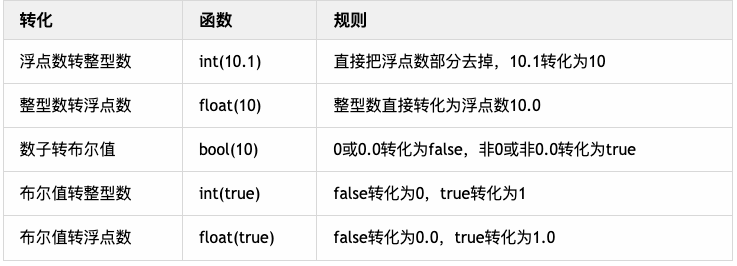

# 基础数据类型
> 着色器语言GLSL的基础数据类型和C语言一样属于强类型语言,整数类型`int`,浮点数`float`,布尔值`bool`数据类型.和我们javascript所使用的数据类型有一些不同之处



## 变量声明
变量声明格式:`<数据类型><变量名>=值;`.需要注意的是末尾的分号必不可少,在着色器语言中所有的结尾都必须带上分号.
```glsl
// 定义一个整数变量
int num = 10;
// 定义一个浮点数变量
float floatNum = 10.0;
// 定义一个布尔值变量
bool boole = true;
```

>注意在强类型语言中,不能将整数与浮点数搞混淆,尤其是浮点数
```glsl
// 由于定义的变量类型是浮点数,但是赋值的却是整数,错误的声明方式;
float num = 10;
// 若要给浮点数类型赋值整数,需要带上小数点
float num = 10.0;
```


## 常量声明
着色器语言和javascript语言一样,可以使用`count`关键字来声明一个常量,让变量在声明之后不可再被更改.
```glsl
// 声明一个整数类型常量
int int count = 10;
// 声明一个浮点数类型常量
float floatCount count = 10.0;
```

## 数据类型转换
整数`int`,浮点数`float`,布尔值`bool`三种不中的数据值可以相互转换,把一个类型转换为另一个类型,只需要使用对应的内置函数`int()`, `float()`,`bool()`



```glsl
// 声明一个整数类型
int num = 1;
// 将整数num转换为浮点数并赋值给fnum
float fnum = float(num);
```

```glsl
// 声明一个浮点数类型
float fnum = 10.01;
// 将浮点数fnum转换为整数并赋值给num
int num = int(fnum);
```

## 变量运算
整数相加结果一定是整数,浮点数相加的结果同样也是浮点数
```glsl
// 整数相加
int x = 5;
int y = 5;
int count = x + y;
```
```glsl
// 浮点数相加
float x = 5.0;
float y = 5.0;
float count = x + y;
```
> 注意两个变量进行运算,需要保持一样的数据类型

## 函数声明
函数计算后,如果有需要返回的值,通过关键字return返回,注意函数声明的时候,函数名称前需要声明return返回的数据类型
```glsl
// 接受两个参数都是浮点数,返回相加后的值
float add(float x, float y){
  return x + y;
}
```

若声明的函数没有返回值,在函数前使用`void`关键字即可
```glsl
void main (){
  float x = 10.0 
}
```
