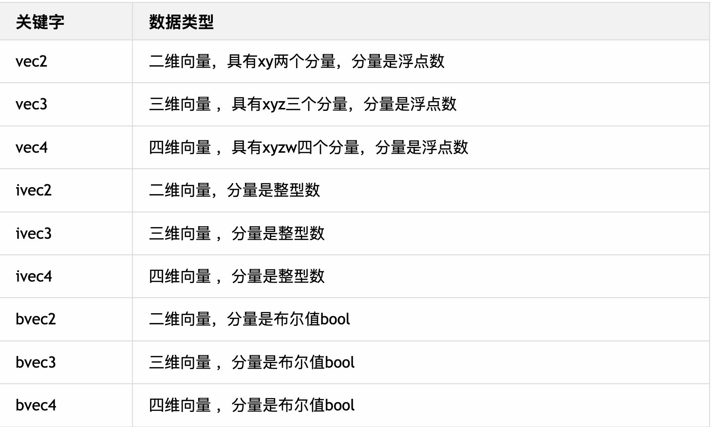
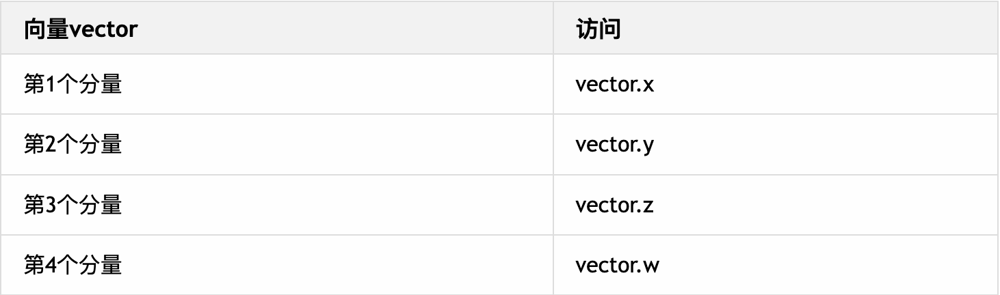

# 向量
向量可以通过2~4个分量表示一个向量,比如通过`vec3(1,0,0)`表示三维空间中一个沿着x轴正方向的三维方向向量

> GLSL向量关键词如下



## 向量声明
向量类型数据需要通过相对应的构造函数创建
```GLSL
// 使用vec3创建一个三维向量,其分量都是浮点数
vec3 spot = vec3(1.0, 1.0, 1.0);

// 使用ivec3创建一个三维向量,其分量都是整数
ivec3 ivec = ivec3(1, 1, 1);

// 使用bvec3创建一个三维向量,其分量都是布尔
bvec3 bvec3 = bvec3(true, true, false);

```


## 向量表示顶点坐标位置
三维向量`vec3`有三个分量,可以用来表示顶点的xyz坐标
```GLSL
// vec3中的三个分量,分别表示xyz坐标
vec3 spot = vec3(1.0, 1.0, 1.0);
```

四维向量`vec4`表示齐次坐标,是GLSL中表示一个顶点坐标的时候,增加的一个分量,用1.0表示
> 齐次坐标: `vec4`中第四个分量的值表示齐次坐标,
> 齐次坐标`(x,y,z, w)`等价于三维坐标的`(x/w, y/w, z/w)`,所以当第四个值为1的时候,可以吧`vec4`定义的矢量当作三维坐标来使用,
> w的值必须大于0, 如果是趋近与0, 则表示点趋近无穷远;

```GLSL
// vec4中的四个分量,分别表示x,y,z;第四个值一般为1
vec4 spot = vec4(1.0, 1.0, 1.0, 1.0);
```

## 向量表示颜色
`vec3`,`vec4`关键字和`int`,`float`一样是用来表示数据类型的,而`vec3`表示三维向量,`vec4`表示四维向量
```GLSL
// 三维向量有三个分量,可以用来表示颜色中的R,G,B
vec3 color = vec3(1.0, 1.0, 1.0);

// 四维向量有四个分量,可以用来表示颜色中的R,G,B,A
vec4 color = vec4(1.0,1.0,1.0,1.0);
```

## 向量低纬度向高维度转换
向量低纬度向高维度转换只需要执行对应的构造函数,再将低纬度向量传入,并补齐所需的分量

```GLSL
// 声明二维向量
vec2 spot_2 = vec2(1.0, 2.0);
// 将二维向量转换至三维向量
vec3 spot_3 = vec3(spot_2, 3,0);//补齐z分量
// 将三维向量转换至四维向量
vec3 spot_4 = vec4(spot_3, 1.0)//补齐w分量
```

## 访问分量
一个向量由多个分量组成,可以通过`.`符号来访问

我们可以向量类比为javascript语言中的对象,通过使用`.x`, `y`, `z`, `w`来访问分量的值


```GLSL
// 声明一个三维向量表三维坐标中的一个点
vec3 spot = vec3(1.0, 1.0, 1.0);
// 访问x坐标
float x = spot.x;
// 访问y坐标
float y = spot.y;
// 改变z坐标
spot.z = spot.z + 1.0;
```

## 向量运算
在GLSL中,向量可以表示多种数据,也能进行多种运算.

### 向量与数字运算

向量加上一个数字,相当于向量中的每个分量都加上该数字
>要注意分量是整数类型还是浮点数类型,加上的数必须与分量的数据类型一直
``` GLSL
vec3 s po t = vec3(1.0, 1.0, 1.0);
// spot 新值为vec3(2.0, 2.0, 2.0)
spot = spot + 1.0; 

// spot值不改变,赋值给了新变量
vec3 spot_2 = spot + 1.0;
```

>减法、乘法、除法运算规则和加法相似

减法
```GLSL
vec3 spot = vec3(1.0, 2.0, 3.0);
// spot 新值为vec3(0.0, 1.0, 2.0);
spot = spot - 1.0;
```

乘法
```GLSL
vec3 spot = vec3(1.0, 2.0, 3.0);
// spot 新值为vec3(2.0, 4.0, 5.0);
spot = spot * 2.0;
```

除法
```GLSL
vec3 spot = vec3(0.5,1.0,1.5);
// spot 新值为vec3(2.0, 4.0, 5.0);
spot = spot / 2.0;
```

### 向量与向量运算

两个向量相加，就是两个向量的三个分量分别相加。

```GLSL
vec3 spot = vec3(1.0, 2.0, 3.0);
vec3 spot_2 = vec3(1.0, 2.0, 3.0);
// spot_3 值为vec3(2.0, 4.0, 6.0);
vec3 spot_3 = spot + spot_2
```

减法
```GLSL
vec3 spot = vec3(1.0, 2.0, 3.0);
vec3 spot_2 = vec3(1.0, 1.0, 1.0);
// spot_3 值为vec3(0.0, 1.0, 2.0);
vec3 spot_3 = spot - spot_2
```

乘法
```GLSL
vec3 spot = vec3(1.0, 2.0, 3.0);
vec3 spot_2 = vec3(1.0, 2.0, 3.0);
// spot_3 值为vec3(1.0, 4.0, 9.0);
vec3 spot_3 = spot * spot_2
```

除法
```GLSL
vec3 spot = vec3(1.0, 2.0, 3.0);
vec3 spot_2 = vec3(1.0, 2.0, 3.0);
// spot_3 值为vec3(1.0, 1.0, 1.0);
vec3 spot_3 = spot / spot_2
```