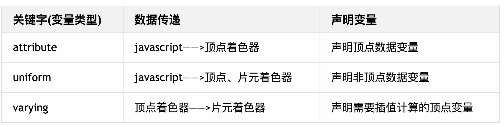

# 变量类型
着色器语言中提供了三个关键字: `attribute`, `uniform`, `varying`,用来声明特定用途的变量

`attribute`和`uniform`关键字的目的主要是为了javascript语言可以通过相关WebGL API把一些数据传递给着色器,如果一个着色器变量,在着色器代码中没有使用`attribute`或`uniform`声明表示,该变量就不能从javascript中获得相对应的数据



## 变量声明

<u>要注意使用这些关键字声明变的量代码必须位于着色器中的main函数之外</u>

定义变量的格式:`<存储限定符><类型><变量名>;`

```GLSL
// 顶点着色器
// attribute 声明顶点变量位置
attribute vec3 spot

void main() {

}
```

```GLSL
// 片元着色器
// uniform 声明片元颜色
uniform vec3 color = vec3(1.0, 1.0, 1.0);

void main() {

}
```

## attribute类型变量
`attribute`关键字通常用来声明与顶点数据相关的变量,比如:顶点位置数据,顶点大小数据,顶点颜色数据

顶点着色器中通过使用`attribute`关键字声明的顶点变量,javascript代码可以通过相关的WebGL API 把顶点数据传递给着色器中相相应的顶点变量

因为javascript没有必要给片元着色器传递顶点相关的数据,所以规定`attribute`关键字只能在顶点着色器中声明变量

```GLSL
// 声明顶点位置变量
attribute vec4 position;
// 声明顶点颜色变量
attribute vec4 color;
```

同一个顶点着色器通常需要处理的是一批顶点数据.一个顶点可能会有多种数据,比如顶点位置,颜色,法向量.还有其它自定义的，比如attribute float scale;，声明了一个scale变量。
```GLSL
// attribute声明顶点位置变量
attribute vec4 position;
// 与顶点相关的浮点数
attribute float scale;
void main() {
  // 每个顶点的x坐标乘以该顶点对应的一个系数scale
  gl_Position = vec4(position.x*scale,position.y,position.z,1.0);
}
```

## uniform 类型变量
 uniform关键字出现的目的就是为了javascript可以通过相关的WebGL API给着色器传递数据,比如光源的位置数据,光源的颜色数据...

 javascript可以给顶点着色器的变量传递数据,也可以给片元着色器的变量传递数据,也就是说uniform关键字既可以在顶点着色器中使用,也可以在片元着色器中使用

 ## varying 类型变量
varying类型变换主要是为了完成顶点着色器和片元着色器之间的数据传递和插值计算.

比如在一个WebGL程序中通过三个顶点绘制一个彩色三角形,三个顶点的位置坐标定义了一个三角形区域,这三角形区域经过片元着色器处理后会得到由一个个片元或则说像素组成的三角形区域,在片元化的过程中,顶点着色器颜色数据也会进行插值计算,插值计算之前米格顶点对应一个颜色,插值计算后,每个片元对应一个颜色值,定过yarying关键字就可以在片元着色器中获得插值计算后的颜色数据,然后赋值给片元.

顶点着色器
```GLSL
// 声明顶点颜色变量
attribute vec4 a_color;
// 声明顶点颜色插值后的变量
varying vec4 v_color;

void main(){
  // 顶点颜色插值变化
  v_color = a_color;
}
```

片元着色器
```GLSL
// 接受顶点着色器中v_color数据;
varying vec4 v_color;
void main(){
  // 将数据赋给片元着色器
 gl_FragColor = v_color;
}

```